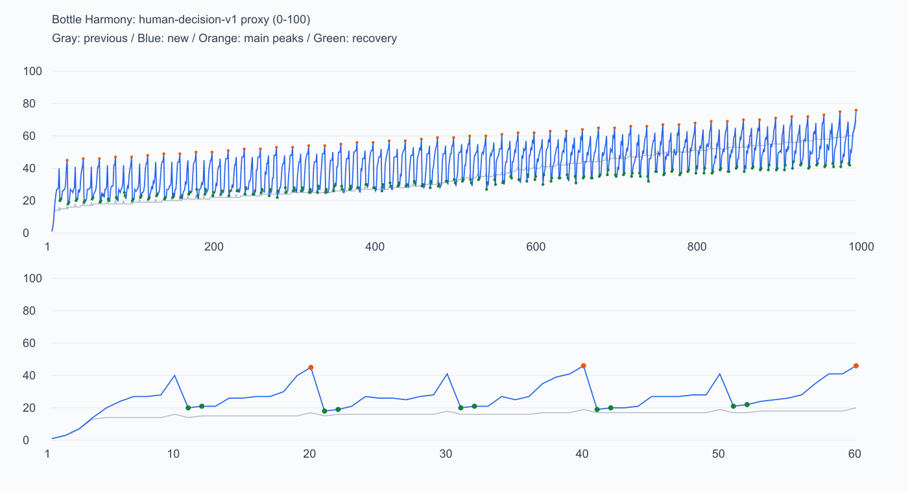

# 千关重新筛选与节奏评价

更新日期：2026 年 10 月 8 日。

结果：mainline-1000-v5，配方 thousand-mountain-v1，难度公式保持 human-decision-v1。SHA256：04e540f8bb21914a1b7dcfff4d29c085aee3cc1fc042e8b7478e3de29fca1795。

**制作目标已达到，可进入连续试玩。** 这版显著提前挑战、增加思考负担，并形成明确的峰后回落；题型重复减少。代理分和标签支持这些制作结论，尚不能证明真人难度或趣味性已经达标。

## 本次实际设置

从 1760 道完整候选中选出 1000 道，保留原题 574 道，引入另外 426 道。新增生成 420 道候选，涵盖六色中段与八九色高峰，全部完成求解与评级；选择池的特征及备用瓶检查未知数均为零。

前三关教学保留。每 20 关一个主峰，第 10 关有次峰；两类高峰各自不下降，主峰至少高于同轮次峰 4 分。各个挑战峰至少高于前九关最高分 5 分，峰后两关至少回落 12 分。整数分允许相邻几轮高峰持平，长期走势上升。

波次角色为教学 3 关、缓冲 198 关、爬坡 499 关、蓄势 200 关、次峰 50 关、主峰 50 关。爬坡内允许最多 2 分的小回落，普通题不再全局升序。选题先保留稀缺高峰与缓冲，再用互相调整分配的匹配检查供给，最后优化相邻题型；这不是全局最优的证明。

缓冲题限制风险反复与连续准备，且不会默认锁住一个备用瓶。100 个高峰也均为直接开放既定瓶数的局面，完整评级与其默认开局相符。其他可选备用瓶题仍可免费启用，单空瓶变体不沿用双空瓶代理分。

首轮次峰目标 40、主峰目标 45，末轮次峰目标 69、主峰目标 74；高峰允许在目标以上 3 分内选择，末关优先最高合格候选。这是暂定制作尺度，不能将其称为真人的 50% 难度。

## 前后对比

| 指标 | 原编排 | 新编排 |
| --- | ---: | ---: |
| D1 关数 | 129 | 8 |
| D2 关数 | 396 | 315 |
| D3 关数 | 351 | 510 |
| D4 关数 | 124 | 167 |
| D3/D4 合计 | 475 | 677 |
| 全库平均代理分 | 35.55 | 42.05 |
| 100 个挑战峰平均分 | 38.66 | 57.04 |
| 第 10 / 20 关分数 | 16 / 17 | 40 / 45 |
| 第 1000 关分数 | 70 | 76 |
| 峰后回落最小值 / 均值 | 1 / 3.14 | 17 / 26.21 |
| 选择风险两项平均贡献 | 5.37 | 8.53 |
| 平均规划级 | 4.09 | 4.77 |
| 平均颜色数 | 6.77 | 6.61 |
| 平均参考倒水次数 | 20.05 | 19.86 |
| 相邻同主类型对 | 738 | 375 |
| 最长同主类型段 | 309 | 7 |
| 策略标签高相似邻接对 | 563 | 286 |

新题平均颜色和参考操作量略降，选择风险与规划贡献上升，支持增难主要来自判断负担而非单纯增加规模和动作。两项贡献仍来自指定代理方法，不能解释成玩家实际思考难度提高的百分比。

图中蓝线为新编排，灰线为原编排，橙点为主峰，绿点为缓冲。分数轴保持 0–100；上图看整体，下面放大前 60 关。主线后的凝固副关卡没有主线同尺度评分，不混入曲线。

## 题型变化与不足

| 标签 | 原关数 | 新关数 |
| --- | ---: | ---: |
| 前段表面进展有风险 | 28 | 88 |
| 参考路线连续准备 | 20 | 18 |
| 参考路线空瓶多色复用 | 52 | 132 |
| 中段观察点有风险 | 96 | 253 |
| 收尾观察点有风险 | 10 | 30 |
| 多个观察点有风险 | 48 | 178 |
| 小棋盘较高规划代理 | 92 | 248 |
| 参考路线部分接收 | 0 | 2 |
| 开局交替色层 | 18 | 2 |
| 开局连续色块较多 | 19 | 16 |
| 开局底色重复 | 238 | 480 |

前段合并诱惑、空瓶复用、中段重新判断与收尾选择都有增加，小棋盘规划也更常见。标签保留证据范围：结构事实、指定参考路线观察、指定局面的精确分支检查；不能据标签声称所有解法必须采用某种策略。

连续准备只有 18 关，仍不足；其中包含一关固定教学。交替色层与连续色块减少，视觉结构变化还有缺口。部分接收出现两道路线样例，值得人工确认是否有真正的巧思。下一轮应优先补准备链和易读的结构变化，而不是继续增加陷阱数量。

前段诱惑、中段风险、反复风险、小棋盘规划和重复底色超过之前讨论的软范围。这次提高整体挑战后，旧比例不再适合作为统一配额；它们作为审阅警报保留，重点确认高峰具有清楚的突破口、缓冲仍足够舒服。相邻重复下降不等于已经证明玩家体验更多样。

## 前二十关

| 关号 | 角色 | 代理分 | 颜色 / 原始总瓶数（含备用瓶） | 主类型 |
| --- | --- | ---: | --- | --- |
| 1 | 教学 | 1 | 2 / 4 | 其他整理型 |
| 2 | 教学 | 3 | 3 / 5 | 宽松多开局型 |
| 3 | 教学 | 7 | 3 / 5 | 连续准备型 |
| 4 | 爬坡 | 14 | 6 / 8 | 宽松多开局型 |
| 5 | 爬坡 | 20 | 5 / 7 | 连续准备型 |
| 6 | 爬坡 | 24 | 7 / 9 | 宽松多开局型 |
| 7 | 爬坡 | 27 | 7 / 9 | 宽松多开局型 |
| 8 | 蓄势 | 27 | 7 / 9 | 宽松多开局型 |
| 9 | 蓄势 | 28 | 7 / 9 | 宽松多开局型 |
| 10 | 次峰 | 40 | 6 / 7 | 前段合并诱惑型 |
| 11 | 缓冲 | 20 | 5 / 7 | 宽松多开局型 |
| 12 | 缓冲 | 21 | 5 / 7 | 宽松多开局型 |
| 13 | 爬坡 | 21 | 5 / 7 | 连续准备型 |
| 14 | 爬坡 | 26 | 7 / 9 | 宽松多开局型 |
| 15 | 爬坡 | 26 | 7 / 9 | 宽松多开局型 |
| 16 | 爬坡 | 27 | 7 / 9 | 宽松多开局型 |
| 17 | 爬坡 | 27 | 7 / 9 | 宽松多开局型 |
| 18 | 蓄势 | 30 | 7 / 9 | 宽松多开局型 |
| 19 | 蓄势 | 40 | 7 / 8 | 其他整理型 |
| 20 | 主峰 | 45 | 5 / 6 | 收尾选择型 |

## 五十轮的主峰与缓冲

| 轮次 | 关号范围 | 次峰 | 主峰 | 主峰后下一关 | 下一关回落 | 本轮均分 |
| --- | --- | ---: | ---: | ---: | ---: | ---: |
| 1 | 1–20 | 40 | 45 | 18 | 27 | 23.70 |
| 2 | 21–40 | 41 | 46 | 19 | 27 | 28.00 |
| 3 | 41–60 | 41 | 46 | 19 | 27 | 28.35 |
| 4 | 61–80 | 42 | 47 | 22 | 25 | 28.25 |
| 5 | 81–100 | 42 | 47 | 20 | 27 | 29.25 |
| 6 | 101–120 | 43 | 48 | 21 | 27 | 29.65 |
| 7 | 121–140 | 44 | 49 | 21 | 28 | 31.50 |
| 8 | 141–160 | 44 | 49 | 22 | 27 | 30.75 |
| 9 | 161–180 | 45 | 50 | 27 | 23 | 31.70 |
| 10 | 181–200 | 45 | 50 | 23 | 27 | 32.05 |
| 11 | 201–220 | 46 | 51 | 23 | 28 | 34.20 |
| 12 | 221–240 | 47 | 52 | 24 | 28 | 34.45 |
| 13 | 241–260 | 47 | 52 | 25 | 27 | 34.55 |
| 14 | 261–280 | 48 | 53 | 22 | 31 | 35.15 |
| 15 | 281–300 | 48 | 53 | 26 | 27 | 35.75 |
| 16 | 301–320 | 49 | 54 | 25 | 29 | 36.50 |
| 17 | 321–340 | 49 | 54 | 25 | 29 | 36.70 |
| 18 | 341–360 | 50 | 55 | 29 | 26 | 37.70 |
| 19 | 361–380 | 51 | 56 | 28 | 28 | 38.50 |
| 20 | 381–400 | 51 | 56 | 28 | 28 | 39.45 |
| 21 | 401–420 | 52 | 57 | 31 | 26 | 39.65 |
| 22 | 421–440 | 52 | 57 | 29 | 28 | 40.35 |
| 23 | 441–460 | 53 | 58 | 29 | 29 | 41.35 |
| 24 | 461–480 | 54 | 59 | 29 | 30 | 41.25 |
| 25 | 481–500 | 54 | 59 | 33 | 26 | 41.80 |
| 26 | 501–520 | 55 | 60 | 33 | 27 | 43.60 |
| 27 | 521–540 | 55 | 60 | 27 | 33 | 44.00 |
| 28 | 541–560 | 56 | 61 | 31 | 30 | 44.55 |
| 29 | 561–580 | 57 | 62 | 33 | 29 | 45.65 |
| 30 | 581–600 | 57 | 62 | 33 | 29 | 45.85 |
| 31 | 601–620 | 58 | 63 | 32 | 31 | 46.90 |
| 32 | 621–640 | 58 | 63 | 36 | 27 | 47.00 |
| 33 | 641–660 | 59 | 64 | 34 | 30 | 46.90 |
| 34 | 661–680 | 60 | 65 | 35 | 30 | 48.10 |
| 35 | 681–700 | 60 | 65 | 36 | 29 | 48.40 |
| 36 | 701–720 | 61 | 66 | 35 | 31 | 48.35 |
| 37 | 721–740 | 61 | 66 | 35 | 31 | 48.45 |
| 38 | 741–760 | 62 | 67 | 36 | 31 | 49.65 |
| 39 | 761–780 | 62 | 67 | 36 | 31 | 50.00 |
| 40 | 781–800 | 63 | 68 | 37 | 31 | 50.80 |
| 41 | 801–820 | 64 | 69 | 37 | 32 | 51.65 |
| 42 | 821–840 | 64 | 69 | 38 | 31 | 50.90 |
| 43 | 841–860 | 65 | 70 | 38 | 32 | 52.55 |
| 44 | 861–880 | 65 | 70 | 39 | 31 | 52.80 |
| 45 | 881–900 | 66 | 71 | 39 | 32 | 53.40 |
| 46 | 901–920 | 67 | 72 | 40 | 32 | 53.60 |
| 47 | 921–940 | 67 | 72 | 40 | 32 | 54.15 |
| 48 | 941–960 | 68 | 73 | 41 | 32 | 54.20 |
| 49 | 961–980 | 68 | 75 | 41 | 34 | 55.15 |
| 50 | 981–1000 | 69 | 76 | 结束 | — | 55.40 |

## 验收与体验评价

本批 1000/1000 独立复核通过，报告绑定同一目录 SHA256；运行资产采用复核成功导出的精简包。完整验证重构全部来源、回放全部路线、重新计算规划与人类代理证据，并重新探测前段及收尾标签；没有用选题缓存替代独立重算。备用瓶名单在最终目录重新检查，预算未知不进入名单。

本批回归测试 137/137、TypeScript 与 ESLint 均通过。备用瓶独立审计为 293 个双空瓶局面：9 可解、284 确证无解、0 未知；排除教学后提供 7 个备用瓶入口。十色、十一色的十二瓶内部对照也保留，并满足现行节奏。验证日志在 builds/wave-selection/，设备构建与连续试玩尚待进行。

整体难度分布与峰谷节奏达到本次制作目标；题型变化有明显改善，连续准备及视觉结构变化仍有不足。早段难度跃升较大，前三关之后应重点试玩第 4–20 关，确认新手能够从教学接上挑战。峰后回落较大也可能被熟练玩家认为太轻松，需要确认恢复感与无聊之间的边界。

每 20 关仍插入凝固副关卡。主线曲线的回落发生在副关卡之后，不能保证玩家一过主峰立即放松；副关卡的凝固与融化体验必须连同第 21、41 等缓冲关一起检查。本次保持其位置、规则和奖励。

真人验证重点：前 40 关、中段两轮、后段两轮；记录关键选择、独立完成、撤销及提示使用。判断“想通了”的时刻是否清楚，高峰是否值得挑战、回落是否恢复信心，再决定是否调整早期高峰、回落幅度或题型比例。未做手机连续试玩，不将桌面复核当作这些问题的答案。

当前内容 ID 已升级；既有预发布存档按现有内容绑定规则从第一关建立新进度，不新增迁移或历史题库。瓶子视觉、倒水规则、免费撤销重来与既有奖励保持原样。

完整逐关标签见本批 [level-details.md](../builds/wave-selection/level-details.md)，关键局面与分支证据见 [selection-report.json](../builds/wave-selection/selection-report.json)。完整目录也保存每题的轮次、角色、主类型和标签；证据在离线报告，手机不执行策略评级。
