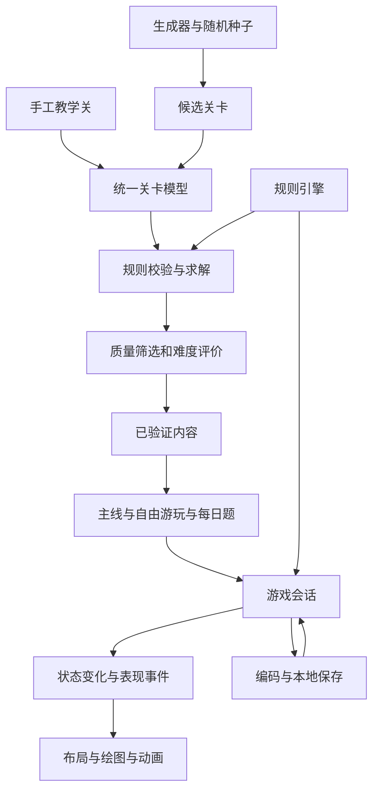
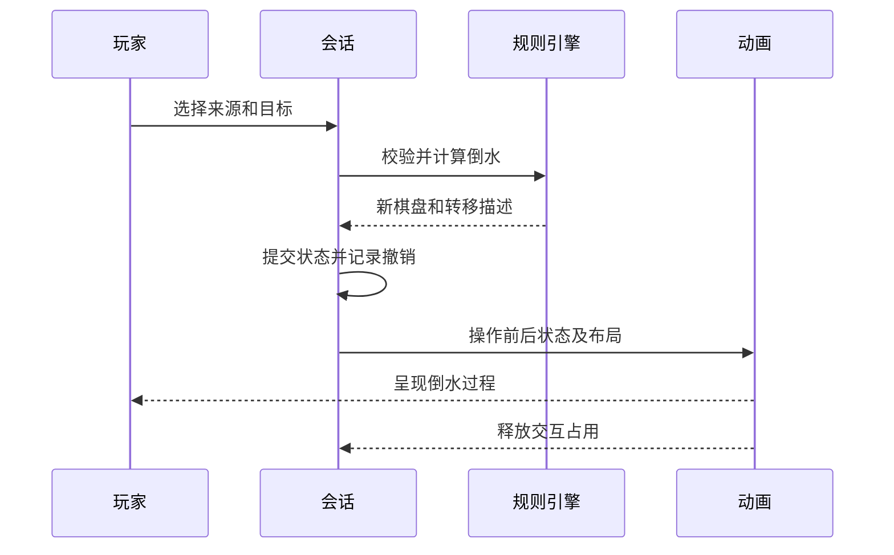

# Bottle Harmony 纯玩版系统方案讨论稿

更新日期：2026 年 10 月 6 日。

Bottle Harmony 第一版采用纯玩方向，专注分拣、撤销重开、完成反馈和继续游玩。内容基础应能持续生产、验证和重现关卡，手工教学关用于引导，不能把此前建议的 20 个经典关卡和 5 个机关关当作整个产品的内容上限。

本次确定先整理系统方案，审阅后再确定具体实施范围。现有代码仍是两色四瓶视觉演示，下面的多色模型、通用求解器、生成器、编码、本地保存和模式入口均是候选设计。每日挑战与自由游玩的范围尚未最终批准。竞品观察见[竞品功能记录](competitor-functional-review.md)，产品与后续合作方向见[游戏模式讨论稿](game-mode-design.md)。

## 系统组成

关卡模型描述瓶子和液体；规则引擎负责合法操作与完成判定；求解器验证是否可解；生成器生产候选关卡；内容筛选判断是否适合游玩；编码保存和重现同一关；模式选择要玩的关卡；会话管理撤销、重开和进度；画面与动画呈现已经接受的操作。

每种模式共用同一套关卡与规则。动画不修改求解规则，生成器不另写一套倒水逻辑；任何新增机关必须同时支持状态、规则、撤销和验证。

## 关卡模型

第一套规则使用四层容量、两至五种颜色、普通可移动瓶，空瓶或顶部同色接收，连续同色按余量转移。特殊容量、固定瓶、隐藏层和解锁暂不进入基础规则实现。

建议将不变的关卡定义与游玩中的会话状态分开：

| 对象 | 主要内容 | 用途 |
|---|---|---|
| 关卡定义 LevelDefinition | 稳定标识、规则标识、颜色目录、瓶子定义、初始液体、来源、目标难度 | 重玩和生成的共同输入 |
| 瓶子定义 BottleDefinition | 稳定标识、容量、显示顺序 | 瓶子数量不再固定为四个；容量初版均为四 |
| 棋盘状态 BoardState | 各瓶实际液体，从底到顶排列 | 规则和求解器使用的真实状态 |
| 会话 GameSession | 关卡标识、当前棋盘、操作历史、完成状态、模式上下文 | 撤销、重开、继续和保存 |
| 求解结果 SolveResult | 解法或未找到解的明确状态、搜索统计 | 验证与内容筛选 |
| 内容记录 ContentRecord | 已验证的关卡、参考解法、难度指标、生成来源 | 正式可游玩内容与回归检查 |

第一版以每种颜色四层为基础，完成条件是所有非空瓶都满且单色。不通过瓶子是否加了瓶塞来判定胜利。未来变容量机制需要独立定义颜色总量与完成目标，不能只把全局容量改大。

关卡标识与颜色标识采用稳定字符串；求解内部可以映射成小整数。界面点击区域、屏幕坐标、渐变颜色和动画时间不进入棋盘状态。瓶子标识不使用动画位置代替，避免换布局后历史指向错误容器。

## 颜色如何表示

颜色分为逻辑身份和视觉主题。关卡只保存 ColorId；美术主题将该标识映射到中文名称、主色、亮色、暗色和可选辨识标记。现有 jade 与 coral 可以继续保留，不把 RGB 色值存入液体规则。

| 层次 | 示例含义 | 设计原则 |
|---|---|---|
| 逻辑颜色 | jade、coral，以及后续新增标识 | 判同色只比较稳定标识 |
| 液体数量 | 某瓶数组中重复的颜色标识 | 每个元素代表一层，连续同色由规则合并转移 |
| 视觉颜色 | 高光、主体、阴影、颜色名称 | 可以换主题而不改变关卡和参考解法 |
| 辅助辨识 | 可选图案或符号、读屏名称 | 后续评估，保证不同颜色在实际手机上容易区分 |

颜色目录先设计五种易区分的液体，不一次扩大到十几种。新主题要验证浅暗背景、玻璃高光与液体层边界，不能只看调色板上的色块。

## 规则引擎与会话

规则引擎提供局面校验、合法倒水查询、合法操作枚举、应用操作和完成判定。所有函数独立于 React Native、动画与存储，供游戏、求解器、生成器和回放共用。

一次有效倒水的结果包含操作前状态、操作后状态、来源与目标标识、颜色和转移层数。会话接受操作时提交后状态并记录历史，随后才发出表现事件。非法操作不改变棋盘和历史。

无合法移动时提示撤销或重开，不扣生命、不丢弃局面。只检测眼前没有合法移动，不默认每次点击后运行完整求解来判断未来是否无解。完成后是否允许继续搬动已满单色瓶，要在实施时统一规则；基础候选是整关完成后进入完成状态，途中普通满瓶仍按合法倒水规则处理。

撤销第一版可保存操作前的完整棋盘快照，重开回到关卡初始状态；未来机关再把解锁等规则状态纳入同一快照。不要只撤销液体而留下已打开的门。选中状态和半程动画是临时表现，不作为恢复游戏的必要数据。

## 求解器

当前 solveDemo 使用广度优先搜索，只适合小规模演示。通用求解器先保证正确，再按实测扩展规模，不能承诺所有大局面都能在手机上快速找到最短解。

候选结果需要区分四种状态：

| 状态 | 含义 | 内容处理 |
|---|---|---|
| solved | 找到完整合法解法并可回放 | 可以进入质量筛选 |
| unsolvable | 在完整状态空间中搜索完毕仍无解 | 拒绝该候选 |
| limitReached | 达到状态数、内存、深度或时间限制 | 尚未验证，不能当作无解或发布 |
| invalid | 输入数量、容量、标识或格式不合法 | 拒绝输入并说明原因 |

初期小规模关卡沿用广度优先搜索。记录访问状态数、耗时、解法长度和搜索是否完整；只有保证最短性的搜索才把解法称为最短解。较大局面再考虑其他搜索策略、剪枝与等价状态合并，不能用未经证明的剪枝牺牲可解验证。

空瓶之间和普通同类瓶之间存在对称；可以合并等价状态，但仍需恢复真实瓶子标识下的可回放路径。带角色、机关或不同容量的瓶子以后不能随意互换。

求解器第一用途是内容验证。提示功能可以复用它，但是否向玩家开放提示单独讨论，不把已验证初始解法机械用于玩家后来改变的局面。

## 游戏生成器

生成器输入规则、颜色数、瓶子数、容量、目标难度和 seed，输出可重现的候选。初版先覆盖普通四层瓶，再扩展机关，不直接生成混合所有机制的关卡。

生成流程为“合法数量构造 → 候选排列 → 求解 → 解法回放 → 质量筛选 → 等价去重 → 接纳”。随机排列只负责提出候选，不能作为可解性的证明。

也可以研究从完成态反向构造，但每一步必须验证逆操作在正向规则下能够还原。最大连续段转移、目标余量和颜色限制会影响可逆性，不能把任意打乱当作有解保证；第一种生成实现优先采用容易核查的候选加求解流程。

### 内容质量

| 指标 | 作用 |
|---|---|
| 颜色数与瓶数 | 控制规模和布局，不单独代表难度 |
| 解法长度 | 估计操作量，区分已找到解与已证明最短解 |
| 连续颜色段与混合程度 | 识别过于简单或只有重复搬运的题 |
| 可用空间和部分接收 | 判断是否涉及中转规划 |
| 合法选择与试玩反馈 | 判断是否有容易理解的决策 |
| 结构等价与近期出现记录 | 避免只换颜色或调换瓶子造成重复内容 |

先用人工审阅的样本建立轻松、标准、思考三个难度档，再校准筛选参数。不先设置一条未经试玩的数学公式就宣称准确难度。

### 生成位置与性能

同一个纯 TypeScript 核心先在 Node.js 制作工具中批量生成和验证，得到可直接打包的内容池。这样主线和初始休闲模式都能离线立即出题。

之后才研究设备端持续生成：限制状态数、内存和时间，避开绘图与动画关键路径；采用所选运行环境实际支持的后台执行方式或分段调度，不在每帧做搜索。手机生成暂时失败时使用已验证备用题，不能交给玩家未经验证的候选。

自由游玩可以从已验证内容池持续抽题，结合近期历史减少重复，再接入设备端生成。有限颜色和瓶数下题目空间也是有限的，“持续游玩”不承诺永远没有重复。内容池耗尽时，允许重新抽取较早题或切换难度，不能让界面停在没有下一关。

## 关卡编码与解码

这里将用户提到的“游戏解码”先理解为保存、导入和重现关卡的编码解码；与找到解法的求解器分开。若以后希望有可视化关卡编辑器，可以在同一个数据格式上增加界面。

第一版先用可读 JSON，内容包括格式标识、规则标识、颜色目录、瓶子定义和实际初始排列。生成关还记录 seed 与生成规则标识。短分享码是后续候选，不是先做自己的复杂压缩协议。

解码后检查格式、数量上限、颜色引用、容量和液体总量；合法格式不等于关卡可解，外部导入题需要重新求解或校验可信内容记录。参考解法也是验证材料，不因附带了一串步骤就直接信任。

只保存 seed 不足以长期重现关卡：生成逻辑变动可能产生不同结果。保存和分享优先包含实际布局；seed 用于追踪来源。预发布阶段维护一个当前格式基线，不为尚未发布的试验建立历史迁移系统。规则和生成标识用于明确重现条件，不代表现在引入多个旧版本支持。

## 三种内容入口

| 模式 | 内容来源 | 候选体验 |
|---|---|---|
| 教学与主线 | 人工策划、通过验证的固定题 | 清楚的学习顺序，逐步介绍新机制 |
| 自由游玩 | 难度档加已验证内容池，之后接设备端生成 | 轻松、标准、思考任选，完成后继续下一题；可跳过不喜欢的题 |
| 每日题 | 日期对应的已验证固定题 | 当天有明确主题或题目，记录完成；做完仍可进入自由游玩 |

自由游玩更直接回应“固定关卡很快玩完”的担忧，建议在通用核心与生成工具成熟后优先拼接。每日题可以提供每日回来的理由，但一天一题本身不足以支持尽情游玩。是否首版加入每日题，等本方案审阅后决定。

纯玩方向的候选每日规则是无倒计时、可重试、完成后可重玩，首次完成只记一次记录；不沿用竞品生命和唯一尝试机会。是否补玩过去日期、日期边界采用设备日期还是统一日期，是独立产品选择。

初期每日题采用随应用提供的已验证内容与确定的日期映射，比在每台手机上临时求解更容易保持一致。若未来用日期 seed 现场生成，要同时固定生成逻辑、候选选择顺序和验证预算；不能因某台手机超时而挑到不同题。最终保存或发布实际每日布局，跨更新也不改已经开始的当日题。

## 绘图 布局与动画接口

保留已经验证的 SVG 绘图与 Reanimated 动画路线。先把四个固定位置改成瓶数驱动的布局，让四至七瓶在小屏与平板上都可读；不直接扩成十几瓶。

布局层将稳定瓶子标识映射到屏幕位置和尺寸。动画层接收操作前后棋盘、来源与目标、颜色、层数和这些位置，再生成抬起、移动、倾斜、液流、回位与完成表现。仍使用共同瓶口坐标连接液流和接收瓶液面，保留同一瓶子绘图组件与独立点击区域。

动画结束只释放交互占用，不再提交一次液体。动画中切后台时立即显示已接受的后状态；减少动态效果时直接切换，同一操作结果不变。保存当前逻辑状态，不保存半程瓶子位置。

将来液团飞行或解锁发光，可以增加新的表现事件；真实规则不由特效触发。完成指定颜色解锁容器是后续第一种机关候选，先证明普通生成与验证链路有效，再扩展它。

## 本地保存与内容管理

保存当前模式、关卡实际定义、棋盘、完成记录，以及自由游玩的近期题目标识。按接受的操作和明确暂停节点写入；恢复时检查数据完整性和规则，不恢复悬空动画。撤销历史是否跨退出保留在实施前确定。

不依赖账号与服务器也能开始和继续纯玩。未来好友分享可以发送同一实际关卡，合作规则需要另外设计，不能把单人棋盘直接作为已实现的多人同步方案。

竞品原始截图与以后其他游戏资料继续留在被 Git 忽略的 `docs/references/`。我们的代码、原创素材、设计文档和经过验证的自有内容记录可以进入项目仓库；本地签名、测试安装包和生成原生目录不提交。

## 建议实施顺序

| 阶段 | 产出 | 完成判断 |
|---|---|---|
| 一 基础模型 | 多色标识、瓶子容量模型、关卡定义、规则、操作回放与撤销边界 | 同一局面在游戏和求解中行为一致，颜色数量守恒 |
| 二 内容工具 | 通用求解器、JSON 编码解码、带 seed 的生成器、筛选与内容池 | 接纳关卡都有可回放解法，超限题不会发布，重复结构受控 |
| 三 单人纯玩 | 教学与主线、自由游玩、动态布局、已有动画、本地保存 | 有下一题，能重开与恢复；多色多瓶在真机上保持可读和流畅 |
| 四 每日与机关 | 日期映射与记录、一种解锁机制的规则与验证 | 每日题可重现，解锁和撤销一致，未完成题不会跨日丢失 |
| 后续合作 | 异步好友章节，之后再考虑共享棋盘 | 单人始终可玩，合作有独立的解题价值 |

第一轮实施建议只确认阶段一和二的范围。动画基础已经存在，后续重在让它接受通用棋盘和布局，不需要等待所有模式完成才验证视觉。

## 验证重点

基础行为测试覆盖合法和非法倒水、最大连续段、部分接收、颜色数量守恒、不可变输入、撤销重开和完成判定。求解测试覆盖有解、确实无解、达到预算、路径回放及同类瓶对称。编码覆盖往返恢复与非法输入；生成覆盖固定 seed 重现、接纳题可解、过滤失败和备用内容。

不是每一关都新增一段手写测试，而是将接纳内容作为数据统一验证。难度与乐趣另靠试玩，不能用测试替代。纯玩模式还要验证连续出题、切后台、存储恢复、多瓶点击区域和真机性能。

## 审阅时先确定的事项

1. 是否按“通用模型与内容工具 → 单人自由游玩 → 每日题与机关”的顺序推进？
2. 第一种自动生成规则是否只限普通四层瓶、两至五色，初期休闲内容重点放在两至四色？
3. 每日题是否采用轻松可重试的方式，与自由游玩并列，而不是限制玩家每天只玩一次？

这些决定确认后，再把每个阶段拆成开发任务。本次只整理方案，没有实现生成器或改变现有游戏规则。
