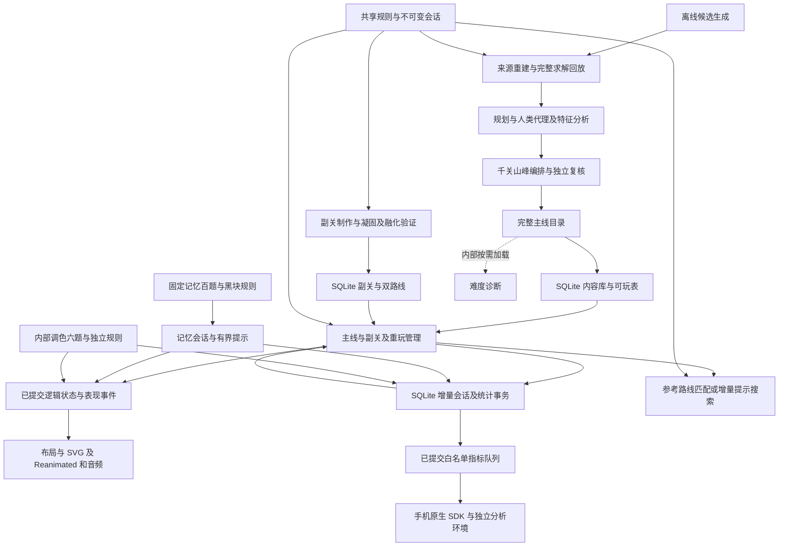

# Bottle Harmony 第一版系统架构

更新日期：2026 年 10 月 10 日。本文描述当前已实现的源码架构，已进入 Google Play 封闭测试，状态见[发布记录](release-readiness.md)；功能与版本总览见[实现基线](current-baseline.md)，逐项玩家行为见[游玩流程](play-flow.md)。后续方案与候选见[产品规则与创意](gameplay-ideas.md)。

## 数据流与职责



离线生产负责证明内容可解、重现来源和统一评价；设备读取已验收资产，不现场生产或完整评级。普通规则和凝固规则由游戏、求解及回放共同使用。渲染、存储和联网不参与规则判定。

## 核心与制作模块

| 模块 | 当前职责 |
| --- | --- |
| `src/game/model.ts`、`codec.ts` | 稳定关卡／瓶子／颜色 ID、统一容量、严格输入校验、实际布局编码 |
| `rules.ts`、`solidRules.ts` | 最大连续同色倒水、完成与合法移动；副关底层凝固限制 |
| `session.ts` | 不可变局面、有界撤销历史、重来、融化与原备用瓶启用 |
| `solver.ts`、`solverAStar.ts` | 分段、有预算 BFS／A*、取消、最短路线和完整无解；未知不升级成结论 |
| `generation.ts`、`generator.ts`、`contentCodec.ts` | 确定来源候选、结构去重、生成预算及完整回放 |
| `difficulty.ts`、`difficultyLoad.ts`、`humanDifficulty.ts` | 旧规划证据与当前 0–100 人类决策代理；离线执行 |
| `levelFeatures.ts`、`featureDistribution.ts` | 结构事实、路线观察与精确分支标签及统计 |
| `productionPlan.ts`、`waveSelection.ts` | 50 个二十关周期、次峰／主峰和回落约束、候选分配 |
| `mainlineCatalog.ts`、`mainlinePlayable.ts`、`solidSide.ts` | 完整目录、严格投影与副关资产载入 |
| `memory.ts`、`memorySolver.ts`、`memoryRoutes.ts` | 稳定单位、黑色兼容规则、自动揭晓、路线映射与有界提示 |
| `memoryDifficulty.ts`、`memoryRatingSearch.ts` | 记忆双轴离线评级；不在手机运行 |
| `mixing.ts`、`mixingCatalog.ts` | 内部六题、两份配方、自动交付与整步撤销 |

主线生产内容最多 11 色／12 瓶、四层；通用模型保护上限 12 色／16 瓶／容量 8，不能据此声称产品支持变容量或十八瓶。生成器支持全打乱、一层底色混排及旧来源重建，现行千关不采用双层固定底色。制作契约见[生成](generation.md)与[配方](production-plan.md)。

`assets/levels/mainline-catalog.json` 保留完整来源与评级证据，`mainline-play.json` 是离线一致性投影；`content.sqlite` 才是随包运行关卡库，启动只读清单，布局、路线及诊断按需查询。`solid-side-50.json` 保存副关双状态路线及单独风险证据，不能套用主线难度分。80 题旧池及 `play.ts`／`playCodec.ts` 保留作工具和回归，公开入口使用 `mainline.ts`。

## 进度与保存

记忆玩法由 `game/memory.ts` 保存稳定液体单位、GameSession 兼容快照与固定遮色；黑块兼容／一次一份和公开终局自动揭晓由独立记忆规则判定，不能直接调用普通同色规则代替。观察／整理／查看与答错后的显色整理分开，揭晓后知识不回退。`MemoryScreen.tsx` 复用原有玻璃、布局、倒水、水声与完成表现。`memoryRepository.ts` 使用同一玩家库和修订队列，增量保存单位快照／知识、独立尝试及辅助事实；不改变主线状态或钱包。具体契约与百题制作见[记忆专题](memory-mode-plan.md)。内部调色由 MixingRepository 保存独立会话／交付及最近 256 步历史，仅内部构建初始化，见[调色实现](mixing-mode.md)。

`mainline.ts` 管理主线、当前副关和已完成关卡的独立重玩。合法倒水先更新会话，立即记录首次完成、提示奖励及副关完成位置；继续操作再切入对应副关或下一主线。第 1000 题后完成副关 50 即结束。重玩和内部预览不推进待完成的主线。

`src/storage/runtime.ts` 初始化两个 SQLite 库；`contentRepository.ts` 按需构造独立核心模型，布局最多缓存 32 关。`playerRepository.ts` 串行事务提交修订、恢复快照、偏好、统计及去重边界；`sessionStorage.ts` 增量追加撤销快照并恢复时校验，`statistics.ts` 维护挑战、尝试、摘要与有界事实。`usePlayProgress.ts` 连接已接受动作和页面／生命周期，单调计时每十秒及动作边界保存，不按帧写库。数据库事务不包含求解和表现。

声音、符号、容器和显式语言选择均在玩家库；选择跟随系统时保存 system，具体系统语言在运行时读取。初始化只对真正空的新库执行一次；错误保留已有库并显示重试。SQLite 基线建立时未继承旧开发存档；闭测已开始，后续更新必须保留现有玩家数据，错误不得触发清库或覆盖。旧 codec 与 writer 只用于离线回归，不参与新版运行保存，没有 AsyncStorage 依赖、双写、导入或回退。product-metrics-v1 在同一事务维护首次事实、时间切片、长期摘要与有界上传队列；src/analytics/ 在提交后异步发送。手机／平板按保存偏好配置原生 SDK，默认新安装开启；Production／Test 分开，Web／TV 离线。没有账号或云存档同步。统计、采集与新基线边界见[统计专题](gameplay-statistics-plan.md)。

## 界面、输入与表现

`App.tsx` 提供安全区域及语言上下文，`DemoScreen.tsx` 虽沿用旧文件名，实际已承载主页／游戏切换、主线与副关、输入、提示、表现及菜单协调。`HomeScreen.tsx` 和 `VesselCarousel.tsx` 负责经典／记忆入口及十五款外观；`MainlineMenu.tsx` 负责虚拟选关、重玩和设置，内部入口受构建配置控制。

`boardLayout.ts` 保留 4–12 瓶统一尺寸、两排最多六列；`deviceLayout.ts` 选择底栏／侧栏及 TV 安全区；`boardNavigation.ts`、`useBoardKeyboard.ts` 与 `FocusablePressable.tsx` 提供键盘／遥控焦点。窗口变化重排显示并取消当前视觉动作，保持已提交液体和进度。实际平台证据见[设备支持](device-support.md)。

`src/art/` 根据各容器真实腔体、瓶口和倾角呈现液体与水流；高脚杯杯脚不盛水。SVG 绘图、点击区域和逻辑瓶子身份分开，切关复用绘图槽位。倒水允许横向越界裁切。完成瓶固定窄口瓶塞／宽口光晕，整局礼花在完成棋盘叠加，视觉结束后显示继续。

`PourSound.tsx` 保持当前音色类三段短播放器准备，出水时只选择已就绪片段；迟到和中途解除静音不补播。礼花声与倒水声共用本地开关。`gamePresentation.ts`、`pourSoundGate.ts` 及相关取消机制处理后台、窗口变化、撤销／重来和减少动态效果。详见[水声与表现](pour-presentation-design.md)。


## 核心接口与保护边界

`LevelDefinition` 保存规则、关卡 ID、统一容量、逻辑颜色目录和稳定瓶 ID；层数组从底到顶。颜色 ID 独立于 RGB，每色总层数等于容量。通用输入允许 2–16 瓶、1–12 色、容量 1–8，现行产品仍为四层、最多十二瓶／十一色。`decodeLevel` 严格检查唯一 ID、引用、守恒、格式和字段，JSON 至多 32768 字符；返回冻结副本，格式有效不代表可解。

`createSession` 复制并冻结输入；`moveSession` 返回新会话及前后棋盘、瓶 ID／索引、颜色和层数事件，拒绝时为 null。`undoSession`／`resetSession` 免费；无历史撤销保持原会话。`meltSession` 保留历史，撤销不 refreeze、重来 refreeze；`extendSessionWithEmptyBottle` 仅接回已验证的原末尾瓶并扩展撤销快照。单色满瓶不额外锁定，整关 solved 停止新倒水但允许撤销／重来；stalled 只表示当前无合法动作。

`createSolver(board, options)` 返回任务，`step(maxExpansions, sliceMilliseconds)` 分段推进，未完成为 null，`cancel()` 释放搜索；`solveBoard` 是离线同步包装。默认五色以内 BFS，更多颜色 A*，下界为颜色段数减颜色数。仅合并规则角色相同的瓶，未融化目标保留身份；实际路线保留真实索引并完整回放。

| 结果 | 契约 |
| --- | --- |
| solved | 最短合法路线，完整回放通过 |
| unsolvable | 完整搜索穷尽 |
| limitReached | 状态／活跃时间预算或取消，结论未知 |
| invalid | 输入或预算非法，附原因 |

默认 30000 状态／250 ms 活跃时间；统计访问、展开、转移、队列峰值与活跃耗时，暂停不计时。无独立精确字节预算，协作切片不是硬实时保证。参考路线提示须匹配实际棋盘；偏离后增量搜索，后台／卸载取消，失效结果不得倒水。

主线／副关／重玩各保留最近 4096 个撤销快照；超过上限用守恒校验的锚点继续存储，累计路线偏移独立保留。实际操作摘要不依赖撤销栈；原始统计按 30 天／5 万事件工程预算清理。SQLite 两库及 WAL 的字节、长历史恢复和写入延迟需分别测量，桌面结果不作为手机性能证据。
内部选题面板只在实际打开时挂载。清单筛选及卡片摘要只能访问预载的 `colorCount`／`bottleCount`／关号，不通过 `level` 惰性 getter 遍历题库；选中实际预览后才构造该局面。这样隐藏工具不触发同步数据库读取，也不挤掉正在玩的布局缓存。
瓶子 SVG 仅定义当前槽位实际使用的颜色渐变；接水／出水图形仅在对应动作挂载，瓶塞／光晕与完成图形在逻辑完成时提前挂载，仍由可见液量和原完成时钟控制显隐。未完成瓶不创建透明的完成子树，凝固几何只在实际凝固时计算。保留同尺寸玻璃、液体几何和原时间线；按需挂载不能成为逻辑提交或推进的条件。

## 性能验证

```sh
npm run benchmark:solver
npm run benchmark:production
```

工具结果按需输出到 `builds/`，是桌面诊断，不作为手机难度或性能结论。Release 真机须测提示总耗时、最长切片、内存、渲染与保存及持续操作；先优化 TypeScript／Hermes，仍不满足预算才评估同契约的 C++ 后端。设备验收见[设备支持](device-support.md)。
