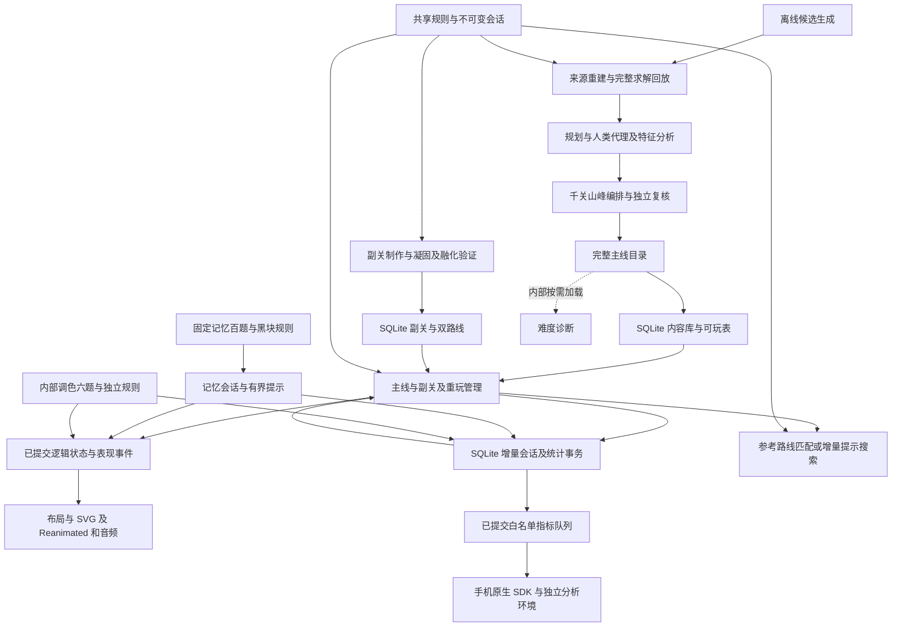

# Bottle Harmony 系统架构与引擎升级方向

更新日期：2026 年 10 月 10 日。本文分别描述当前已实现的源码架构，以及尚未实现的排序引擎升级方案。应用已进入 Google Play 封闭测试，状态见[发布记录](release-readiness.md)；功能与版本总览见[实现基线](current-baseline.md)，逐项玩家行为见[游玩流程](play-flow.md)。产品方案与候选见[产品规则与创意](gameplay-ideas.md)。

## 数据流与职责



离线生产负责证明内容可解、重现来源和统一评价；设备读取已验收资产，不现场生产或完整评级。普通规则和凝固规则由游戏、求解及回放共同使用。渲染、存储和联网不参与规则判定。

## 核心与制作模块

| 模块 | 当前职责 |
| --- | --- |
| `src/game/model.ts`、`codec.ts` | 稳定关卡／瓶子／颜色 ID、统一容量、严格输入校验、实际布局编码 |
| `rules.ts`、`solidRules.ts` | 最大连续同色倒水、完成与合法移动；副关底层凝固限制 |
| `session.ts` | 不可变局面、有界撤销历史、重来、融化与原备用瓶启用 |
| `solver.ts`、`solverAStar.ts` | 分段、有预算 BFS／A*、取消、最短路线和完整无解；未知不升级成结论 |
| `generation.ts`、`generator.ts`、`contentCodec.ts` | 确定来源候选、结构去重、生成预算及完整回放 |
| `difficulty.ts`、`difficultyLoad.ts`、`humanDifficulty.ts` | 旧规划证据与当前 0–100 人类决策代理；离线执行 |
| `levelFeatures.ts`、`featureDistribution.ts` | 结构事实、路线观察与精确分支标签及统计 |
| `productionPlan.ts`、`waveSelection.ts` | 50 个二十关周期、次峰／主峰和回落约束、候选分配 |
| `mainlineCatalog.ts`、`mainlinePlayable.ts`、`solidSide.ts` | 完整目录、严格投影与副关资产载入 |
| `memory.ts`、`memorySolver.ts`、`memoryRoutes.ts` | 稳定单位、黑色兼容规则、自动揭晓、路线映射与有界提示 |
| `memoryDifficulty.ts`、`memoryRatingSearch.ts` | 记忆双轴离线评级；不在手机运行 |
| `mixing.ts`、`mixingCatalog.ts` | 内部六题、两份配方、自动交付与整步撤销 |

主线生产内容最多 11 色／12 瓶、四层；通用模型保护上限 12 色／16 瓶／容量 8，不能据此声称产品支持变容量或十八瓶。生成器支持全打乱、一层底色混排及旧来源重建，现行千关不采用双层固定底色。制作契约见[生成](generation.md)与[配方](production-plan.md)。

`assets/levels/mainline-catalog.json` 保留完整来源与评级证据，`mainline-play.json` 是离线一致性投影；`content.sqlite` 才是随包运行关卡库，启动只读清单，布局、路线及诊断按需查询。`solid-side-50.json` 保存副关双状态路线及单独风险证据，不能套用主线难度分。80 题旧池及 `play.ts`／`playCodec.ts` 保留作工具和回归，公开入口使用 `mainline.ts`。

## 进度与保存

记忆玩法由 `game/memory.ts` 保存稳定液体单位、GameSession 兼容快照与固定遮色；黑块兼容／一次一份和公开终局自动揭晓由独立记忆规则判定，不能直接调用普通同色规则代替。观察／整理／查看与答错后的显色整理分开，揭晓后知识不回退。`MemoryScreen.tsx` 复用原有玻璃、布局、倒水、水声与完成表现。`memoryRepository.ts` 使用同一玩家库和修订队列，增量保存单位快照／知识、独立尝试及辅助事实；不改变主线状态或钱包。具体契约与百题制作见[记忆专题](memory-mode-plan.md)。内部调色由 MixingRepository 保存独立会话／交付及最近 256 步历史，仅内部构建初始化，见[调色实现](mixing-mode.md)。

`mainline.ts` 管理主线、当前副关和已完成关卡的独立重玩。合法倒水先更新会话，立即记录首次完成、提示奖励及副关完成位置；继续操作再切入对应副关或下一主线。第 1000 题后完成副关 50 即结束。重玩和内部预览不推进待完成的主线。

`src/storage/runtime.ts` 初始化两个 SQLite 库；`contentRepository.ts` 按需构造独立核心模型，布局最多缓存 32 关。`playerRepository.ts` 串行事务提交修订、恢复快照、偏好、统计及去重边界；`sessionStorage.ts` 增量追加撤销快照并恢复时校验，`statistics.ts` 维护挑战、尝试、摘要与有界事实。`usePlayProgress.ts` 连接已接受动作和页面／生命周期，单调计时每十秒及动作边界保存，不按帧写库。数据库事务不包含求解和表现。

声音、符号、容器和显式语言选择均在玩家库；选择跟随系统时保存 system，具体系统语言在运行时读取。初始化只对真正空的新库执行一次；错误保留已有库并显示重试。SQLite 基线建立时未继承旧开发存档；闭测已开始，后续更新必须保留现有玩家数据，错误不得触发清库或覆盖。旧 codec 与 writer 只用于离线回归，不参与新版运行保存，没有 AsyncStorage 依赖、双写、导入或回退。product-metrics-v1 在同一事务维护首次事实、时间切片、长期摘要与有界上传队列；src/analytics/ 在提交后异步发送。手机／平板按保存偏好配置原生 SDK，默认新安装开启；Production／Test 分开，Web／TV 离线。没有账号或云存档同步。统计、采集与新基线边界见[统计专题](gameplay-statistics-plan.md)。

## 界面、输入与表现

`App.tsx` 提供安全区域及语言上下文，`DemoScreen.tsx` 虽沿用旧文件名，实际已承载主页／游戏切换、主线与副关、输入、提示、表现及菜单协调。`HomeScreen.tsx` 和 `VesselCarousel.tsx` 负责经典／记忆入口及十五款外观；`MainlineMenu.tsx` 负责虚拟选关、重玩和设置，内部入口受构建配置控制。

`boardLayout.ts` 保留 4–12 瓶统一尺寸、两排最多六列；`deviceLayout.ts` 选择底栏／侧栏及 TV 安全区；`boardNavigation.ts`、`useBoardKeyboard.ts` 与 `FocusablePressable.tsx` 提供键盘／遥控焦点。窗口变化重排显示并取消当前视觉动作，保持已提交液体和进度。实际平台证据见[设备支持](device-support.md)。

`src/art/` 根据各容器真实腔体、瓶口和倾角呈现液体与水流；高脚杯杯脚不盛水。SVG 绘图、点击区域和逻辑瓶子身份分开，切关复用绘图槽位。倒水允许横向越界裁切。完成瓶固定窄口瓶塞／宽口光晕，整局礼花在完成棋盘叠加，视觉结束后显示继续。

`PourSound.tsx` 保持当前音色类三段短播放器准备，出水时只选择已就绪片段；迟到和中途解除静音不补播。礼花声与倒水声共用本地开关。`gamePresentation.ts`、`pourSoundGate.ts` 及相关取消机制处理后台、窗口变化、撤销／重来和减少动态效果。详见[水声与表现](pour-presentation-design.md)。


## 核心接口与保护边界

`LevelDefinition` 保存规则、关卡 ID、统一容量、逻辑颜色目录和稳定瓶 ID；层数组从底到顶。颜色 ID 独立于 RGB，每色总层数等于容量。通用输入允许 2–16 瓶、1–12 色、容量 1–8，现行产品仍为四层、最多十二瓶／十一色。`decodeLevel` 严格检查唯一 ID、引用、守恒、格式和字段，JSON 至多 32768 字符；返回冻结副本，格式有效不代表可解。

`createSession` 复制并冻结输入；`moveSession` 返回新会话及前后棋盘、瓶 ID／索引、颜色和层数事件，拒绝时为 null。`undoSession`／`resetSession` 免费；无历史撤销保持原会话。`meltSession` 保留历史，撤销不 refreeze、重来 refreeze；`extendSessionWithEmptyBottle` 仅接回已验证的原末尾瓶并扩展撤销快照。单色满瓶不额外锁定，整关 solved 停止新倒水但允许撤销／重来；stalled 只表示当前无合法动作。

`createSolver(board, options)` 返回任务，`step(maxExpansions, sliceMilliseconds)` 分段推进，未完成为 null，`cancel()` 释放搜索；`solveBoard` 是离线同步包装。默认五色以内 BFS，更多颜色 A*，下界为颜色段数减颜色数。仅合并规则角色相同的瓶，未融化目标保留身份；实际路线保留真实索引并完整回放。

| 结果 | 契约 |
| --- | --- |
| solved | 最短合法路线，完整回放通过 |
| unsolvable | 完整搜索穷尽 |
| limitReached | 状态／活跃时间预算或取消，结论未知 |
| invalid | 输入或预算非法，附原因 |

默认 30000 状态／250 ms 活跃时间；统计访问、展开、转移、队列峰值与活跃耗时，暂停不计时。无独立精确字节预算，协作切片不是硬实时保证。参考路线提示须匹配实际棋盘；偏离后增量搜索，后台／卸载取消，失效结果不得倒水。

主线／副关／重玩各保留最近 4096 个撤销快照；超过上限用守恒校验的锚点继续存储，累计路线偏移独立保留。实际操作摘要不依赖撤销栈；原始统计按 30 天／5 万事件工程预算清理。SQLite 两库及 WAL 的字节、长历史恢复和写入延迟需分别测量，桌面结果不作为手机性能证据。
内部选题面板只在实际打开时挂载。清单筛选及卡片摘要只能访问预载的 `colorCount`／`bottleCount`／关号，不通过 `level` 惰性 getter 遍历题库；选中实际预览后才构造该局面。这样隐藏工具不触发同步数据库读取，也不挤掉正在玩的布局缓存。
瓶子 SVG 仅定义当前槽位实际使用的颜色渐变；接水／出水图形仅在对应动作挂载，瓶塞／光晕与完成图形在逻辑完成时提前挂载，仍由可见液量和原完成时钟控制显隐。未完成瓶不创建透明的完成子树，凝固几何只在实际凝固时计算。保留同尺寸玻璃、液体几何和原时间线；按需挂载不能成为逻辑提交或推进的条件。

## 后续排序引擎扩展（未实现）

**已确认的架构目标：优先做好可扩展排序引擎，现有经典排序运行于升级后的底层时仍保持原规则与体验。** 容器须独立描述容量、源／目标操作权限和固定表现，完成目标须独立于普通排序判定。用户明确当前先支持搬运归类和收集既有目标色，不加入混色生成新颜色。扩展能力用于支持后续不同题目和表现，不意味着必须改动现有千关。钥匙、盖布与逐层显色属于经典排序可使用的关卡能力，不新增揭秘模式；人工精选内容及圆球排序仍是[后续产品设想](gameplay-ideas.md)，不是已实施能力。

当前 `BottleDefinition` 只有 ID 和颜色层数组，容量是 `LevelDefinition` 的全局字段；`validateBoard` 要求每色总量等于全局容量，`isSolved` 要求所有非空瓶均满且单色。核心虽允许统一容量 1–8，产品使用四份，但尚不支持同题混合容量、每瓶操作权限或局部目标。内部调色已有四份原料瓶与两份调色杯的专用处理，不等于通用容器模型已经完成。

建议以以下职责边界逐步扩展，当前接口名称与具体格式尚未冻结：

| 层次 | 负责什么 | 不应承担什么 |
| --- | --- | --- |
| 容器定义与状态 | 每只容器独立容量、源／目标权限、固定位置表现、稳定单位内容及动态访问状态 | 把每色数量、普通排序匹配或整关完成写死在容器内 |
| 转移规则与条件 | 取顶、接收匹配、转移数量及权限／机关状态检查，产生确定性动作结果 | 水流几何、圆球轨迹、音效或付费判断 |
| 关卡目标 | 全盘整理、指定色收集、指定层序及显式组合条件；同一判定供游戏、求解和回放使用 | 默认每关都必须全盘满瓶单色，或通过目标暗中禁止错误输入 |
| 关卡能力与定义 | 固定布局、钥匙／盖布映射、初始遮盖、能力版本与合法组合 | 按动画进度开锁，或每题复制一套引擎 |
| 会话、信息与共用工具 | 一份真实局面、已公开信息、动作事件、撤销／重来；求解和独立回放使用同一转换规则 | 因画面形式不同而维护互相漂移的棋盘和规则 |
| 表现与交互 | 根据可见局面和动作事件实现水流、玻璃，或未来的球移动／落下；将操作映射为逻辑动作 | 从物理碰撞或动画结束推导通关、奖励或真实排列 |
| 内容编排、进度与访问资格 | 选择可进入的关卡、顺序与首次完成、奖励去重；未来精选内容资格 | 通过 Premium 改变同一题的移动规则或解法 |

水与球可以共享容器排序的基础，但“每次一颗”和“最大连续同色段”须是明确的转移数量规则。只有规则相同才直接复用路线；改变动作量后必须重新求解、回放并评估难度。引擎应传递中性的单位转移与能力事件，水流或球的动画自行解释；无需为逻辑正确性引入真实流体或刚体物理模拟。

升级验收先保证无新增能力的经典关卡结果、路线、撤销、提示、奖励和恢复不变，再分别验证新增能力。当前 SQLite、内容版本绑定与有界历史尚不自动支持这些扩展，必须显式处理版本和增量更新、保护现有玩家数据；不得通过清库达到升级目的。先建立容器、转移与目标契约，再接入已有经典规则、三种已规划能力和固定目标容器；未来表现仅预留边界，不提前实现所有玩法或通用脚本平台。

### 容器、转移与目标的具体边界

以下为已确定需要支持的能力与建议模型，字段命名、编码和接口尚未实现或冻结：

| 对象 | 应描述的内容 |
| --- | --- |
| 容器定义 | 稳定 ID、独立容量、是否允许作为源、是否允许作为接收目标；固定位置／表现约束与外观引用分开。容量以等量离散份表示，同题可有四、五、六、十二份等不同容量 |
| 容器状态 | 有序单位 ID、是否锁定、当前生效的操作限制；占用量由单位序列推导，初始定义与可变状态分开保存 |
| 转移配置 | 可取部分、每次移动数量、目标如何接收；普通同色匹配与配方杯允许异色叠入分别声明，不由瓶形或目标标签推断 |
| 目标定义 | 全盘整理规则，或指定容器／颜色／数量的收集目标，或从底到顶的精确颜色序列；是否要求满、是否还要求其他容器整理／清空均显式描述 |

容量与源／目标权限属于容器能力定义，合法动作必须读取这些属性，再与排序规则、访问状态及余量一起判定；二者职责分开，但不是互不影响。瓶身位置固定也不自动等于禁止作为源：固定表现、允许倒出、允许接收是三个独立维度。只接收容器禁止发起普通倒出，系统撤销仍能回退已接受的倒入动作；锁定／显色等动态能力不覆盖此通用撤销契约。

目标容器只是被某个目标引用的普通逻辑容器，不凭“目标”标签自动改变接收规则。经典接收器可要求同色；彩虹容器可允许异色叠入并在规定时机检查层序，不能用完成目标逐次拒绝错误颜色来泄露隐藏答案。目标类型与检查时机须与具体玩法一起定义，不能让渲染或通关按钮决定。

例如，若干四份周转瓶配一只容量十二份、固定且只接收的大瓶，关卡目标可以是“大瓶恰有十二份红色”，其余容器不必整理完；十二份红色必须在初始题目中已有足量，不能在收集时生成。改成彩虹目标时，使用明确的底到顶颜色序列并允许该目标容器接收不同颜色，转移规则及是否检查余料另按题目声明。这说明同一容器基础可以服务不同目标，并不改变现有经典关的全盘完成要求。

基础模型校验每瓶占用不超过其自身容量，按题目初始库存保持各色数量守恒；不再普遍假定“每种颜色只够装满一只瓶”或“颜色总数等于某只容器容量”。经典规则配置继续单独要求四份容量、每色恰四份和现有完成条件。混色／加工若以后单独推进，需另定转换与守恒契约，不进入本次收集目标范围。

二十至三十只瓶的例子是未来规模需求，核心设计应能在显式资源预算下配置容器数量，不能与画面的固定列数绑死；当前产品十二瓶／两排大瓶、核心十六瓶上限和移动端验证范围并未因此自动扩大。大容量容器的可读性、布局、解算状态数与性能需独立原型验证，不能把调大校验上限当作支持完成。

### 建议的数据与接口契约

本节是实施建议，不是已存在的类型或已冻结的 API。引擎质量目标是规则确定、可验证、可恢复和可扩展；先覆盖已确认需求，不追求能执行任意玩法的脚本系统。采用 TypeScript 的明确类型与有限策略组合，不先建设深层继承、动态插件或第二套棋盘。

| 契约 | 建议内容与边界 |
| --- | --- |
| `PuzzleDefinition` | 不可变的关卡 ID／内容修订、编码版本、规则版本、单位与容器目录、初始排列、能力配置、目标；完整题目从开局存在，解锁只改变访问和信息 |
| `ContainerDefinition` | 容量、源／接收权限及接收策略引用；表现固定与外观使用独立展示配置，渲染形状不参与动作合法性 |
| `UnitDefinition` | 稳定单位 ID 与逻辑颜色 ID；单位是等量离散份，水／球均可引用。颜色不以 RGB 表示，初始库存从定义推导 |
| `PuzzleState` | 各容器从底到顶的单位排列、可回退的机关状态；不重复保存占用量、满瓶标志或可从当前状态计算的完成状态 |
| `AttemptKnowledge` | 本次尝试已经公开的单位信息，与真实颜色、可操作权限分开；具体撤销／重来语义服从各能力契约 |
| `Action` | 使用稳定容器 ID 的转移动作，以及已批准的能力动作；数量由规则计算，调用方不能指定任意颜色／数量绕过规则 |
| `TransitionResult` | 接受时返回下一状态、知识、目标判定及有序领域事件；拒绝时返回明确原因且状态不变，不留下半次动作 |
| `Session` | 关卡与规则绑定、当前状态和知识、按能力保留的辅助事实、修订号、有界撤销与锚点；完成奖励和商业资格由外部应用流程负责 |

转移规则先采用少量明确配置：取顶部、一次一份或最大连续同色、目标同色匹配或允许异色叠入。目标先支持全盘整理、指定容器收集指定色／数量、指定底到顶序列，必要时用有限的“全部满足”组合；不允许目标谓词隐式改变接收规则。其他容器是否整理、目标是否要求满和内容是否必须全为目标色均须显式定义，不能只用含糊的“收集十二份”描述。

对外以稳定 ID 表达操作和引用，对内可编译为紧凑索引，避免在搜索节点复制整份定义或反复解析字符串。初始普通内容可按固定瓶／层顺序确定单位 ID，编号规则随编码固定；不可因撤销、换皮肤或恢复重新编号。单位 ID 支持知识追踪，但同色且知识、能力角色完全相同的单位不必在搜索中人为区分；身份只有影响未来动作或信息时才进入去重键。

建议最小接口为 `validateDefinition`、`createInitialState`、`listLegalActions`、`transition`、`evaluateGoal`、`projectVisibleState` 与按规则配置的 `createSearchTask`。这些是职责名称，不承诺最终文件名；合法性枚举和执行调用同一转移内核，游戏、求解和路线回放不各写一套实现。撤销／重来由共用会话操作处理，存储只序列化已接受结果，表现只消费可见投影及事件。

依赖方向保持向内：编码适配、求解、会话、存储适配和表现调用领域契约，纯逻辑不导入 React、Reanimated、Expo、SQLite 或分析 SDK。现有 `model.ts`／`rules.ts` 承载模型与纯转移改造，`session.ts` 承载历史与知识语义，求解模块消费该内核，存储模块负责版本与事务。`DemoScreen.tsx` 逐步只保留操作及表现协调，进度／奖励留在主线应用流程；不为此次改造重写十五款绘图、统计系统或题库生产器。

### 单次动作、知识与表现

一次转移按以下顺序在纯逻辑中完成；全过程不等待动画、不访问数据库、不取随机数：

1. 检查会话修订、容器引用、访问权限、顶层可取范围、接收策略和余量，得到唯一合法移动量。
2. 在临时下一状态中移动真实单位，计算该动作触发的机关与信息公开。一个阶段中同时满足的机关一起更新；若需连锁，再按固定阶段重复至稳定，不能依赖遍历或动画先后。
3. 按本关目标检查完成，生成有序的转移／开放／显色／目标变化事件，统一提交下一状态和知识。非法配置、触发循环或超出明确能力处理预算时拒绝整个转换，不提交中间结果。
4. 应用层以会话修订和尝试身份接收结果，去重记录完成／奖励并排队事务保存；随后启动表现。取消表现只丢弃视觉任务，不回滚已接受动作；撤销必须调用逻辑会话。

当前钥匙／盖布的自动开放可设计为动作内只增不减、每个触发至多执行一次，因此连锁有有限上界；不能引入同一动作内反复开关的回调环。具体触发与知识规则仍由对应能力方案维护，逐层显色倒水是否停止在隐藏边界尚待确认，不用实现选择代替产品决定。

会话须区分三类事实：可撤销的排列与机关、按能力保留的尝试信息／辅助状态、尝试外耐久的完成与奖励事实。钥匙撤销会重新锁定但保留已见信息；现有凝固副关撤销不重新凝固、备用瓶启用不收回，必须保持各自已批准语义。不能用“撤销整份状态快照”统一抹除这些差异。重来按本关能力恢复初始局面，尝试外已发奖励不会重发。

界面、辅助符号、读屏与提示展示只读取 `projectVisibleState`，交给表现层的事件也须按同一信息边界投影。真实颜色可以供底层守恒和离线可解性检查使用，不能因未知部分真实同色而泄露到选择高亮、拒绝原因、可见事件或提示文字。全知解法只证明题目真实状态可解，不证明信息公平；隐藏题的提示与分支质量须另有只依据已公开信息的策略及证据，未通过前不能直接复用普通参考路线作为玩家提示。

界面组件不直接查询规则数据库或修改机关。提示任务绑定尝试、内容版本和会话修订；结果回来时再次核对并验证动作，撤销、重来或切关后不得应用旧结果。棋盘动画期间的输入门控继续由交互层执行，不把动画进度加入逻辑状态或存档。

### 求解、校验与存储的改进重点

**先正确，再优化。** 当前 A* 的“颜色段数减颜色数”下界只在已证明的原规则中使用。收集目标、层序目标、不同转移量和机关须选择适用的启发式；未证明时采用零下界或 BFS，不能继续声称沿用旧下界仍保证最短。多容量／只接收／目标瓶／机关关联瓶不能仅按颜色排列排序合并。优先保留容器身份，之后只在证明等价的类别内做对称化，并验证路线能映射回真实 ID。

搜索状态包括所有影响未来合法动作、目标及信息的状态；规则和不变定义由任务共享，不进入每个节点的完整副本。状态、活跃时间、切片和内存均需明确预算，保持取消能力及 solved／unsolvable／unknown／invalid 的区别。无合法动作与完整证明无解仍是两个结论，不在每步操作启动全局求解。扩大瓶数／容量前先报告状态规模和真机成本，不能靠调高上限宣称完成支持。

校验分三层：编码结构和引用有效；容量、唯一单位、初始库存、权限与能力／目标组合有效；实际规则下可解且信息公平。前两层不替代第三层。规则策略、目标类型、能力及版本均使用白名单，未知类型拒绝，禁止静默退回普通排序。内容导出后读回定义与路线，并从独立库存、权限和目标断言检查每步结果，避免只靠同一个转换函数自证正确。

保留现有正式编码读取，经过验证后规范化到新领域模型；新能力使用明确的新编码／规则版本，不能通过放宽旧解析器让旧关卡含义改变。题目 ID、内容修订、规则／能力版本、初始定义摘要、会话格式与 SQLite schema 版本分别绑定，外观切换不改变逻辑摘要。相同 ID 的规则或布局变化不能直接套用旧局面。

保存记录单位排列、能力状态、知识、有界动作／检查点及版本绑定；恢复校验库存、唯一单位、能力关系和历史转换。采用现有串行事务与修订队列，增量升级现有 SQLite，保护主线、副关、记忆、钱包、偏好、身份和统计。初始化只对真正新库执行；升级失败保留原数据并提供重试。不得清库、静默换题或加入旧开发 JSON／AsyncStorage 导入。该存储改动的具体表结构在实施时与[统计存储方案](gameplay-statistics-plan.md)同步。

### 分阶段实施与验收

按可独立验证的阶段推进，避免把新模型、所有玩法和新画面同时切入。以下为建议实施方向，尚未开始代码改造：

| 阶段 | 实施内容 | 验收门槛 |
| --- | --- | --- |
| 1．建立契约与兼容基准 | 明确新类型、转移顺序、目标及版本；用现有解码器到新领域模型的适配层表达普通四份规则 | 当前千关与五十副关的定义、参考路线和正式存档可读取；现有合法动作、结果及规则差异有可比基准 |
| 2．完成纯逻辑内核 | 独立容量与权限、单份／连续段转移、同色／异色接收、三类目标；接入共用会话、撤销与重来 | 经典路径逐步差分一致；四／五／六／十二份混合容量、仅源／仅接收、固定表现、余量、颜色／层序目标的边界通过 |
| 3．接通求解、回放与恢复 | 使用同一内核，适配状态键／启发式；严格编码、SQLite 增量升级与恢复、失效提示拦截 | 新目标完整路线与独立断言通过；搜索限额正确报告未知；当前已发布库升级、冷启及反复恢复保留进度和奖励去重 |
| 4．接入明确的关卡能力 | 先单项钥匙与盖布，再在边界决定后接入逐层显色；验证拟使用的组合 | 同步触发、有限连锁、撤销重新锁定与知识保留、重来、存取及信息公平通过；机关内容标准见专属方案 |
| 5．接入表现并做设备验收 | 经典页面改为消费投影和事件，逐步接入大容量／锁定表现；保持现有玻璃与操作体验 | 倒水、音频、取消、输入、读屏、小屏可读性、存储及持续性能通过；现有内容与进度体验不变 |

阶段 1–3 构成基础引擎首个可验收里程碑；阶段 4–5 证明扩展能力实际可用。每阶段只切换已经通过验证的链路，旧实现作为测试对照按需要保留，切换完成后删除重复运行路径，不长期双写或维护两套规则。记忆与内部调色先保持当前实现；以后复用通用基础时各自做等价验证，不为统一名称改变万能块或混色语义。

验收必须覆盖确定性（同定义／状态／动作产生同结果）、非法动作不变、单位唯一与逐色守恒、容量／权限、目标边界、机关同步与终止、知识公开边界、撤销／重来和保存往返。采用手工边界题、小状态穷举、确定种子的动作序列与现有题库逐步差分；独立不变量断言与完整路线互相补充，不以单条参考解证明所有分支正确。存储升级另验证真实旧版本数据库副本及写入中断恢复。

新增模型、求解、保存和实际布局均未实现，本节不能作为已交付声明。首次里程碑聚焦经典兼容与已确认基础契约；精选 Premium、圆球资源、更多瓶子布局和新题库不是本轮架构讨论的交付承诺。

钥匙／盖布／逐层显色的专属状态、信息规则和验收由[经典关卡扩展规划](color-unlock-plan.md#底层扩展设计与现有实现边界)维护；本节拥有引擎的通用职责划分。

## 性能验证

```sh
npm run benchmark:solver
npm run benchmark:production
```

工具结果按需输出到 `builds/`，是桌面诊断，不作为手机难度或性能结论。Release 真机须测提示总耗时、最长切片、内存、渲染与保存及持续操作；先优化 TypeScript／Hermes，仍不满足预算才评估同契约的 C++ 后端。设备验收见[设备支持](device-support.md)。
